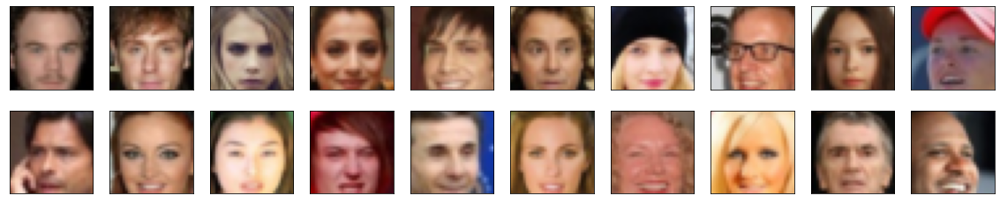
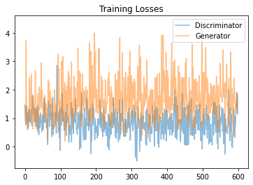
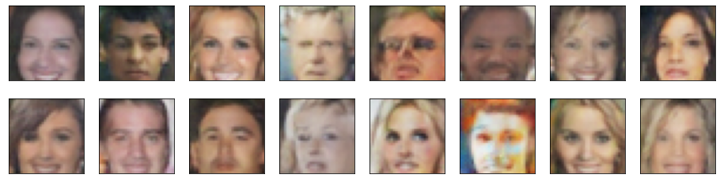

# Face Generation

In this project, you'll define and train a DCGAN on a dataset of faces. Your goal is to get a generator network to generate *new* images of faces that look as realistic as possible!

The project will be broken down into a series of tasks from **loading in data to defining and training adversarial networks**. At the end of the notebook, you'll be able to visualize the results of your trained Generator to see how it performs; your generated samples should look like fairly realistic faces with small amounts of noise.

### Get the Data

You'll be using the [CelebFaces Attributes Dataset (CelebA)](http://mmlab.ie.cuhk.edu.hk/projects/CelebA.html) to train your adversarial networks.

This dataset is more complex than the number datasets (like MNIST or SVHN) you've been working with, and so, you should prepare to define deeper networks and train them for a longer time to get good results. It is suggested that you utilize a GPU for training.

### Pre-processed Data

Since the project's main focus is on building the GANs, we've done *some* of the pre-processing for you. Each of the CelebA images has been cropped to remove parts of the image that don't include a face, then resized down to 64x64x3 NumPy images. Some sample data is show below.


> If you are working locally, you can download this data [by clicking here](https://s3.amazonaws.com/video.udacity-data.com/topher/2018/November/5be7eb6f_processed-celeba-small/processed-celeba-small.zip)

This is a zip file that you'll need to extract in the home directory of this notebook for further loading and processing. After extracting the data, you should be left with a directory of data `processed_celeba_small/`


```python
# for reproducibility
import random
random.seed(0)
```


```python
# for monitoring
from torch.profiler import profile, record_function, ProfilerActivity
```


```python
# can comment out after executing
#!unzip processed_celeba_small.zip
```


```python
data_dir = 'processed_celeba_small/'

"""
DON'T MODIFY ANYTHING IN THIS CELL
"""
import pickle as pkl
import matplotlib.pyplot as plt
import numpy as np
import problem_unittests as tests
#import helper

%matplotlib inline
```

## Visualize the CelebA Data

The [CelebA](http://mmlab.ie.cuhk.edu.hk/projects/CelebA.html) dataset contains over 200,000 celebrity images with annotations. Since you're going to be generating faces, you won't need the annotations, you'll only need the images. Note that these are color images with [3 color channels (RGB)](https://en.wikipedia.org/wiki/Channel_(digital_image)#RGB_Images) each.

### Pre-process and Load the Data

Since the project's main focus is on building the GANs, we've done *some* of the pre-processing for you. Each of the CelebA images has been cropped to remove parts of the image that don't include a face, then resized down to 64x64x3 NumPy images. This *pre-processed* dataset is a smaller subset of the very large CelebA data.

> There are a few other steps that you'll need to **transform** this data and create a **DataLoader**.

#### Exercise: Complete the following `get_dataloader` function, such that it satisfies these requirements:

* Your images should be square, Tensor images of size `image_size x image_size` in the x and y dimension.
* Your function should return a DataLoader that shuffles and batches these Tensor images.

#### ImageFolder

To create a dataset given a directory of images, it's recommended that you use PyTorch's [ImageFolder](https://pytorch.org/docs/stable/torchvision/datasets.html#imagefolder) wrapper, with a root directory `processed_celeba_small/` and data transformation passed in.


```python
# necessary imports
import torch
from torchvision import datasets
from torchvision import transforms
```


```python
def get_dataloader(batch_size, image_size, data_dir='processed_celeba_small/'):
    """
    Batch the neural network data using DataLoader
    :param batch_size: The size of each batch; the number of images in a batch
    :param img_size: The square size of the image data (x, y)
    :param data_dir: Directory where image data is located
    :return: DataLoader with batched data
    """
    
    # TODO: Implement function and return a dataloader
    transformations = transforms.Compose([transforms.Resize(size=image_size),
                                         transforms.ToTensor()])
    
    image_data = datasets.ImageFolder(root=data_dir, transform=transformations)
    
    data_loader = torch.utils.data.DataLoader(dataset=image_data, batch_size=batch_size, shuffle=True)
    
    return data_loader

```

## Create a DataLoader

#### Exercise: Create a DataLoader `celeba_train_loader` with appropriate hyperparameters.

Call the above function and create a dataloader to view images. 
* You can decide on any reasonable `batch_size` parameter
* Your `image_size` **must be** `32`. Resizing the data to a smaller size will make for faster training, while still creating convincing images of faces!


```python
# Define function hyperparameters
batch_size = 32
img_size = 32

"""
DON'T MODIFY ANYTHING IN THIS CELL THAT IS BELOW THIS LINE
"""
# Call your function and get a dataloader
celeba_train_loader = get_dataloader(batch_size, img_size)

```

Next, you can view some images! You should seen square images of somewhat-centered faces.

Note: You'll need to convert the Tensor images into a NumPy type and transpose the dimensions to correctly display an image, suggested `imshow` code is below, but it may not be perfect.


```python
# helper display function
def imshow(img):
    npimg = img.numpy()
    plt.imshow(np.transpose(npimg, (1, 2, 0)))

"""
DON'T MODIFY ANYTHING IN THIS CELL THAT IS BELOW THIS LINE
"""
# obtain one batch of training images
dataiter = iter(celeba_train_loader)
images, _ = dataiter.next() # _ for no labels

# plot the images in the batch, along with the corresponding labels
fig = plt.figure(figsize=(20, 4))
plot_size=20
for idx in np.arange(plot_size):
    ax = fig.add_subplot(2, plot_size/2, idx+1, xticks=[], yticks=[])
    imshow(images[idx])
```

    <ipython-input-8-13b4d9c7a4be>:17: MatplotlibDeprecationWarning: Passing non-integers as three-element position specification is deprecated since 3.3 and will be removed two minor releases later.
      ax = fig.add_subplot(2, plot_size/2, idx+1, xticks=[], yticks=[])
    


    

    


#### Exercise: Pre-process your image data and scale it to a pixel range of -1 to 1

You need to do a bit of pre-processing; you know that the output of a `tanh` activated generator will contain pixel values in a range from -1 to 1, and so, we need to rescale our training images to a range of -1 to 1. (Right now, they are in a range from 0-1.)


```python
# TODO: Complete the scale function
def scale(x, feature_range=(-1, 1)):
    ''' Scale takes in an image x and returns that image, scaled
       with a feature_range of pixel values from -1 to 1. 
       This function assumes that the input x is already scaled from 0-1.'''
    # assume x is scaled to (0, 1)
    # scale to feature_range and return scaled x
    range_min, range_max = feature_range
    x = x * (range_max - range_min) + range_min
    return x

```


```python
"""
DON'T MODIFY ANYTHING IN THIS CELL THAT IS BELOW THIS LINE
"""
# check scaled range
# should be close to -1 to 1
img = images[0]
scaled_img = scale(img)

print('Min: ', scaled_img.min())
print('Max: ', scaled_img.max())
```

    Min:  tensor(-1.)
    Max:  tensor(0.7647)
    

---
# Define the Model

A GAN is comprised of two adversarial networks, a discriminator and a generator.

## Discriminator

Your first task will be to define the discriminator. This is a convolutional classifier like you've built before, only without any maxpooling layers. To deal with this complex data, it's suggested you use a deep network with **normalization**. You are also allowed to create any helper functions that may be useful.

#### Exercise: Complete the Discriminator class
* The inputs to the discriminator are 32x32x3 tensor images
* The output should be a single value that will indicate whether a given image is real or fake


```python
import torch.nn as nn
import torch.nn.functional as F
```


```python
def conv(in_channels, out_channels, kernel_size, stride=2, padding=1, batch_norm=True):
    layers = []
    layers.append(nn.Conv2d(in_channels, out_channels, kernel_size, stride, padding, bias=False))
    if batch_norm:
        layers.append(nn.BatchNorm2d(out_channels))
    return nn.Sequential(*layers)
```


```python
class Discriminator(nn.Module):

    def __init__(self, conv_dim):
        """
        Initialize the Discriminator Module
        :param conv_dim: The depth of the first convolutional layer
        """
        super(Discriminator, self).__init__()

        # complete init function
        self.conv_dim = conv_dim
        self.conv1 = conv(3, conv_dim, 4, batch_norm=False) # conv_dim x 16 x 16
        self.conv2 = conv(conv_dim, conv_dim*2, 4) # 2conv_dim x 8 x 8
        self.conv3 = conv(conv_dim*2, conv_dim*4, 4) # 4conv_dim x 4 x 4
        self.conv4 = conv(conv_dim*4, conv_dim*8, 4) # 8conv_dim x 2 x 2
        self.fc = nn.Linear(8 * conv_dim * 2 * 2, 1)

    def forward(self, x):
        """
        Forward propagation of the neural network
        :param x: The input to the neural network     
        :return: Discriminator logits; the output of the neural network
        """
        # define feedforward behavior
        x = F.leaky_relu(self.conv1(x), 0.2)
        x = F.leaky_relu(self.conv2(x), 0.2)
        x = F.leaky_relu(self.conv3(x), 0.2)
        x = F.dropout2d(x)
        x = F.leaky_relu(self.conv4(x), 0.2)
        x = x.view(-1, 8 * self.conv_dim * 2 * 2)
        x = self.fc(x)
        return x

"""
DON'T MODIFY ANYTHING IN THIS CELL THAT IS BELOW THIS LINE
"""
tests.test_discriminator(Discriminator)
```

    Tests Passed
    

## Generator

The generator should upsample an input and generate a *new* image of the same size as our training data `32x32x3`. This should be mostly transpose convolutional layers with normalization applied to the outputs.

#### Exercise: Complete the Generator class
* The inputs to the generator are vectors of some length `z_size`
* The output should be a image of shape `32x32x3`


```python
def de_conv(in_channels, out_channels, kernel_size, stride=2, padding=1, batch_norm=True):
    layers = []
    layers.append(nn.ConvTranspose2d(in_channels, out_channels, kernel_size, stride, padding, bias=False))
    if batch_norm:
        layers.append(nn.BatchNorm2d(out_channels))
    return nn.Sequential(*layers)
```


```python
class Generator(nn.Module):
    
    def __init__(self, z_size, conv_dim):
        """
        Initialize the Generator Module
        :param z_size: The length of the input latent vector, z
        :param conv_dim: The depth of the inputs to the *last* transpose convolutional layer
        """
        super(Generator, self).__init__()

        # complete init function
        self.conv_dim = conv_dim
        self.fc = nn.Linear(z_size, 16 * conv_dim * 1 * 1) # 16conv_dim x 1 x 1
        self.conv1 = de_conv(conv_dim*16, conv_dim*8, 4) # 8conv_dim x 2 x 2
        self.conv2 = de_conv(conv_dim*8, conv_dim*4, 4) # 4conv_dim x 4 x 4
        self.conv3 = de_conv(conv_dim*4, conv_dim*2, 4) # 2conv_dim x 8 x 8
        self.conv4 = de_conv(conv_dim*2, conv_dim, 4) # conv_dim x 16 x 16
        self.conv5 = de_conv(conv_dim, 3, 4, batch_norm=False) # 3 x 32 x 32

    def forward(self, x):
        """
        Forward propagation of the neural network
        :param x: The input to the neural network     
        :return: A 32x32x3 Tensor image as output
        """
        # define feedforward behavior
        x = self.fc(x)
        x = x.view(-1, 16 * self.conv_dim, 1, 1)
        x = F.leaky_relu(self.conv1(x), 0.2)
        x = F.leaky_relu(self.conv2(x), 0.2)
        x = F.leaky_relu(self.conv3(x), 0.2)
        x = F.dropout2d(x)
        x = F.leaky_relu(self.conv4(x), 0.2)
        x = torch.tanh(self.conv5(x))
        return x

"""
DON'T MODIFY ANYTHING IN THIS CELL THAT IS BELOW THIS LINE
"""
tests.test_generator(Generator)
```

    Tests Passed
    

## Initialize the weights of your networks

To help your models converge, you should initialize the weights of the convolutional and linear layers in your model. From reading the [original DCGAN paper](https://arxiv.org/pdf/1511.06434.pdf), they say:
> All weights were initialized from a zero-centered Normal distribution with standard deviation 0.02.

So, your next task will be to define a weight initialization function that does just this!

You can refer back to the lesson on weight initialization or even consult existing model code, such as that from [the `networks.py` file in CycleGAN Github repository](https://github.com/junyanz/pytorch-CycleGAN-and-pix2pix/blob/master/models/networks.py) to help you complete this function.

#### Exercise: Complete the weight initialization function

* This should initialize only **convolutional** and **linear** layers
* Initialize the weights to a normal distribution, centered around 0, with a standard deviation of 0.02.
* The bias terms, if they exist, may be left alone or set to 0.


```python
def weights_init_normal(m):
    """
    Applies initial weights to certain layers in a model .
    The weights are taken from a normal distribution 
    with mean = 0, std dev = 0.02.
    :param m: A module or layer in a network    
    """
    # classname will be something like:
    # `Conv`, `BatchNorm2d`, `Linear`, etc.
    classname = m.__class__.__name__
    
    # TODO: Apply initial weights to convolutional and linear layers
    if classname.find("Conv") != -1:
        m.weight.data.normal_(mean=0.0, std=0.02)
        if m.bias != None:
            m.bias.data.fill_(0.0)
    
    if classname.find("Linear") != -1:
        m.weight.data.normal_(mean=0.0, std=0.02)
        if m.bias != None:
            m.bias.data.fill_(0.0)
```

## Build complete network

Define your models' hyperparameters and instantiate the discriminator and generator from the classes defined above. Make sure you've passed in the correct input arguments.


```python
"""
DON'T MODIFY ANYTHING IN THIS CELL THAT IS BELOW THIS LINE
"""
def build_network(d_conv_dim, g_conv_dim, z_size):
    # define discriminator and generator
    D = Discriminator(d_conv_dim)
    G = Generator(z_size=z_size, conv_dim=g_conv_dim)

    # initialize model weights
    D.apply(weights_init_normal)
    G.apply(weights_init_normal)

    print(D)
    print()
    print(G)
    
    return D, G

```

#### Exercise: Define model hyperparameters


```python
# Define model hyperparams
d_conv_dim = 64
g_conv_dim = 64
z_size = 100

"""
DON'T MODIFY ANYTHING IN THIS CELL THAT IS BELOW THIS LINE
"""
D, G = build_network(d_conv_dim, g_conv_dim, z_size)
```

    Discriminator(
      (conv1): Sequential(
        (0): Conv2d(3, 64, kernel_size=(4, 4), stride=(2, 2), padding=(1, 1), bias=False)
      )
      (conv2): Sequential(
        (0): Conv2d(64, 128, kernel_size=(4, 4), stride=(2, 2), padding=(1, 1), bias=False)
        (1): BatchNorm2d(128, eps=1e-05, momentum=0.1, affine=True, track_running_stats=True)
      )
      (conv3): Sequential(
        (0): Conv2d(128, 256, kernel_size=(4, 4), stride=(2, 2), padding=(1, 1), bias=False)
        (1): BatchNorm2d(256, eps=1e-05, momentum=0.1, affine=True, track_running_stats=True)
      )
      (conv4): Sequential(
        (0): Conv2d(256, 512, kernel_size=(4, 4), stride=(2, 2), padding=(1, 1), bias=False)
        (1): BatchNorm2d(512, eps=1e-05, momentum=0.1, affine=True, track_running_stats=True)
      )
      (fc): Linear(in_features=2048, out_features=1, bias=True)
    )
    
    Generator(
      (fc): Linear(in_features=100, out_features=1024, bias=True)
      (conv1): Sequential(
        (0): ConvTranspose2d(1024, 512, kernel_size=(4, 4), stride=(2, 2), padding=(1, 1), bias=False)
        (1): BatchNorm2d(512, eps=1e-05, momentum=0.1, affine=True, track_running_stats=True)
      )
      (conv2): Sequential(
        (0): ConvTranspose2d(512, 256, kernel_size=(4, 4), stride=(2, 2), padding=(1, 1), bias=False)
        (1): BatchNorm2d(256, eps=1e-05, momentum=0.1, affine=True, track_running_stats=True)
      )
      (conv3): Sequential(
        (0): ConvTranspose2d(256, 128, kernel_size=(4, 4), stride=(2, 2), padding=(1, 1), bias=False)
        (1): BatchNorm2d(128, eps=1e-05, momentum=0.1, affine=True, track_running_stats=True)
      )
      (conv4): Sequential(
        (0): ConvTranspose2d(128, 64, kernel_size=(4, 4), stride=(2, 2), padding=(1, 1), bias=False)
        (1): BatchNorm2d(64, eps=1e-05, momentum=0.1, affine=True, track_running_stats=True)
      )
      (conv5): Sequential(
        (0): ConvTranspose2d(64, 3, kernel_size=(4, 4), stride=(2, 2), padding=(1, 1), bias=False)
      )
    )
    

### Training on GPU

Check if you can train on GPU. Here, we'll set this as a boolean variable `train_on_gpu`. Later, you'll be responsible for making sure that 
>* Models,
* Model inputs, and
* Loss function arguments

Are moved to GPU, where appropriate.


```python
"""
DON'T MODIFY ANYTHING IN THIS CELL
"""
import torch

# Check for a GPU
train_on_gpu = torch.cuda.is_available()
if not train_on_gpu:
    print('No GPU found. Please use a GPU to train your neural network.')
else:
    print('Training on GPU!')
```

    Training on GPU!
    

---
## Discriminator and Generator Losses

Now we need to calculate the losses for both types of adversarial networks.

### Discriminator Losses

> * For the discriminator, the total loss is the sum of the losses for real and fake images, `d_loss = d_real_loss + d_fake_loss`. 
* Remember that we want the discriminator to output 1 for real images and 0 for fake images, so we need to set up the losses to reflect that.


### Generator Loss

The generator loss will look similar only with flipped labels. The generator's goal is to get the discriminator to *think* its generated images are *real*.

#### Exercise: Complete real and fake loss functions

**You may choose to use either cross entropy or a least squares error loss to complete the following `real_loss` and `fake_loss` functions.**


```python
"""
def real_loss(D_out):
    '''Calculates how close discriminator outputs are to being real.
       param, D_out: discriminator logits
       return: real loss'''
    criterion = nn.BCEWithLogitsLoss()
    labels = torch.ones(D_out.shape)
    if train_on_gpu:
        labels = labels.cuda()
    loss = criterion(D_out, labels)
    return loss

def fake_loss(D_out):
    '''Calculates how close discriminator outputs are to being fake.
       param, D_out: discriminator logits
       return: fake loss'''
    criterion = nn.BCEWithLogitsLoss()
    labels = torch.zeros(D_out.shape)
    if train_on_gpu:
        labels = labels.cuda()
    loss = criterion(D_out, labels)
    return loss
"""

import random
from random import randrange, uniform

def real_loss(D_out):
    '''Calculates how close discriminator outputs are to being real.
       param, D_out: discriminator logits
       return: real loss'''
    batch_size = D_out.size(0)
    # label smoothing
    labels = torch.ones(batch_size) * np.random.uniform(0.7, 1.2)
    # labels = torch.ones(batch_size) * 0.9
    # labels = torch.ones(batch_size) # real labels = 1
    if train_on_gpu:
        labels = labels.cuda()
    criterion = nn.BCEWithLogitsLoss()
    loss = criterion(D_out.squeeze(), labels)
    # loss = torch.mean(-loss)
    # loss = torch.mean((D_out-1)**2)
    return loss

def fake_loss(D_out):
    '''Calculates how close discriminator outputs are to being fake.
       param, D_out: discriminator logits
       return: fake loss'''
    batch_size = D_out.size(0)
    # labels = torch.zeros(batch_size) + 0.0 # fake labels = 0
    labels = torch.ones(batch_size) * np.random.uniform(0.0, 0.3) # fake labels = 0.3
    # print(labels)
    if train_on_gpu:
        labels = labels.cuda()
    criterion = nn.BCEWithLogitsLoss()
    loss = criterion(D_out.squeeze(), labels)
    # loss = torch.mean(loss)
    # loss = torch.mean(D_out**2)
    return loss
```

## Optimizers

#### Exercise: Define optimizers for your Discriminator (D) and Generator (G)

Define optimizers for your models with appropriate hyperparameters.


```python
import torch.optim as optim

learn_rate = 0.0002
beta1 = 0.5
beta2 = 0.999

# Create optimizers for the discriminator D and generator G
d_optimizer = optim.Adam(D.parameters(), lr=learn_rate, betas=(beta1, beta2))
g_optimizer = optim.Adam(G.parameters(), lr=learn_rate, betas=(beta1, beta2))
```

---
## Training

Training will involve alternating between training the discriminator and the generator. You'll use your functions `real_loss` and `fake_loss` to help you calculate the discriminator losses.

* You should train the discriminator by alternating on real and fake images
* Then the generator, which tries to trick the discriminator and should have an opposing loss function


#### Saving Samples

You've been given some code to print out some loss statistics and save some generated "fake" samples.

#### Exercise: Complete the training function

Keep in mind that, if you've moved your models to GPU, you'll also have to move any model inputs to GPU.


```python
def train(D, G, n_epochs, print_every=200):
    '''Trains adversarial networks for some number of epochs
       param, D: the discriminator network
       param, G: the generator network
       param, n_epochs: number of epochs to train for
       param, print_every: when to print and record the models' losses
       return: D and G losses'''
    
    # move models to GPU
    if train_on_gpu:
        D.cuda()
        G.cuda()

    # keep track of loss and generated, "fake" samples
    samples = []
    losses = []

    # Get some fixed data for sampling. These are images that are held
    # constant throughout training, and allow us to inspect the model's performance
    sample_size=16
    fixed_z = np.random.uniform(-1, 1, size=(sample_size, z_size))
    fixed_z = torch.from_numpy(fixed_z).float()
    # move z to GPU if available
    if train_on_gpu:
        fixed_z = fixed_z.cuda()

    # epoch training loop
    for epoch in range(n_epochs):

        # batch training loop
        for batch_i, (real_images, _) in enumerate(celeba_train_loader):

            batch_size = real_images.size(0)
            real_images = scale(real_images)

            # ===============================================
            #         YOUR CODE HERE: TRAIN THE NETWORKS
            # ===============================================
            
            # 1. Train the discriminator on real and fake images
            d_optimizer.zero_grad()
            z = np.random.uniform(-1, 1, size=(batch_size, z_size))
            z = torch.from_numpy(z).float()
            if train_on_gpu:
                real_images, z = real_images.cuda(), z.cuda()
            d_out = D(real_images)
            real_loss_0 = real_loss(d_out)
            with torch.no_grad():
                fake_image = G(z)
            d_out = D(fake_image)
            fake_loss_0 = fake_loss(d_out)
            d_loss = real_loss_0 + fake_loss_0
            d_loss.backward()
            d_optimizer.step()

            # 2. Train the generator with an adversarial loss
            g_optimizer.zero_grad()
            z = np.random.uniform(-1, 1, size=(batch_size, z_size))
            z = torch.from_numpy(z).float()
            if train_on_gpu:
                z = z.cuda()
            fake_image = G(z)
            d_out = D(fake_image)
            g_loss = real_loss(d_out)
            g_loss.backward()
            g_optimizer.step()
            
            # ===============================================
            #              END OF YOUR CODE
            # ===============================================

            # Print some loss stats
            if batch_i % print_every == 0:
                # append discriminator loss and generator loss
                losses.append((d_loss.item(), g_loss.item()))
                # print discriminator and generator loss
                print('Epoch [{:5d}/{:5d}] | d_loss: {:6.4f} | g_loss: {:6.4f}'.format(
                        epoch+1, n_epochs, d_loss.item(), g_loss.item()))


        ## AFTER EACH EPOCH##    
        # this code assumes your generator is named G, feel free to change the name
        # generate and save sample, fake images
        G.eval() # for generating samples
        with torch.no_grad():
            samples_z = G(fixed_z)
            samples_z = samples_z.detach().cpu()
            samples.append(samples_z)
        G.train() # back to training mode

    # Save training generator samples
    with open('train_samples.pkl', 'wb') as f:
        pkl.dump(samples, f)
    
    # finally return losses
    return losses
```

Set your number of training epochs and train your GAN!


```python
# set number of epochs 
n_epochs = 40

"""
DON'T MODIFY ANYTHING IN THIS CELL
"""
# call training function
losses = train(D, G, n_epochs=n_epochs)
```

    Epoch [    1/   40] | d_loss: 1.4326 | g_loss: 1.4886
    Epoch [    1/   40] | d_loss: 1.1789 | g_loss: 0.9076
    Epoch [    1/   40] | d_loss: 0.7619 | g_loss: 0.9917
    Epoch [    1/   40] | d_loss: 1.1485 | g_loss: 3.7210
    Epoch [    1/   40] | d_loss: 1.1015 | g_loss: 1.6222
    Epoch [    1/   40] | d_loss: 1.4256 | g_loss: 0.9423
    Epoch [    1/   40] | d_loss: 0.8323 | g_loss: 0.5893
    Epoch [    1/   40] | d_loss: 1.0615 | g_loss: 1.1904
    Epoch [    1/   40] | d_loss: 1.1849 | g_loss: 0.7961
    Epoch [    1/   40] | d_loss: 0.6329 | g_loss: 1.2156
    Epoch [    1/   40] | d_loss: 1.3160 | g_loss: 0.7125
    Epoch [    1/   40] | d_loss: 0.9308 | g_loss: 0.8819
    Epoch [    1/   40] | d_loss: 1.2437 | g_loss: 2.4440
    Epoch [    1/   40] | d_loss: 1.2700 | g_loss: 1.3970
    Epoch [    1/   40] | d_loss: 0.9269 | g_loss: 1.0589
    Epoch [    2/   40] | d_loss: 0.8754 | g_loss: 0.8433
    Epoch [    2/   40] | d_loss: 0.9959 | g_loss: 1.9545
    Epoch [    2/   40] | d_loss: 1.0008 | g_loss: 2.2576
    Epoch [    2/   40] | d_loss: 1.2891 | g_loss: 2.5384
    Epoch [    2/   40] | d_loss: 0.7433 | g_loss: 1.1882
    Epoch [    2/   40] | d_loss: 1.2128 | g_loss: 1.8316
    Epoch [    2/   40] | d_loss: 1.7542 | g_loss: 1.7352
    Epoch [    2/   40] | d_loss: 1.4354 | g_loss: 0.6233
    Epoch [    2/   40] | d_loss: 1.3429 | g_loss: 1.8080
    Epoch [    2/   40] | d_loss: 1.3989 | g_loss: 1.5998
    Epoch [    2/   40] | d_loss: 1.1586 | g_loss: 1.3039
    Epoch [    2/   40] | d_loss: 1.1578 | g_loss: 1.0737
    Epoch [    2/   40] | d_loss: 0.8728 | g_loss: 0.8679
    Epoch [    2/   40] | d_loss: 1.3196 | g_loss: 1.4205
    Epoch [    2/   40] | d_loss: 0.8136 | g_loss: 2.6665
    Epoch [    3/   40] | d_loss: 0.7091 | g_loss: 0.8904
    Epoch [    3/   40] | d_loss: 1.3461 | g_loss: 1.2747
    Epoch [    3/   40] | d_loss: 0.8690 | g_loss: 0.9937
    Epoch [    3/   40] | d_loss: 1.0747 | g_loss: 1.2727
    Epoch [    3/   40] | d_loss: 0.6188 | g_loss: 1.0186
    Epoch [    3/   40] | d_loss: 1.4516 | g_loss: 1.8632
    Epoch [    3/   40] | d_loss: 1.2921 | g_loss: 0.4973
    Epoch [    3/   40] | d_loss: 0.6593 | g_loss: 0.9436
    Epoch [    3/   40] | d_loss: 1.1464 | g_loss: 0.6675
    Epoch [    3/   40] | d_loss: 0.4196 | g_loss: 1.5506
    Epoch [    3/   40] | d_loss: 1.0525 | g_loss: 2.0864
    Epoch [    3/   40] | d_loss: 0.8390 | g_loss: 1.9842
    Epoch [    3/   40] | d_loss: 0.6551 | g_loss: 1.2956
    Epoch [    3/   40] | d_loss: 0.9242 | g_loss: 1.3551
    Epoch [    3/   40] | d_loss: 1.1843 | g_loss: 1.6592
    Epoch [    4/   40] | d_loss: 0.8251 | g_loss: 2.1410
    Epoch [    4/   40] | d_loss: 0.9293 | g_loss: 2.9491
    Epoch [    4/   40] | d_loss: 0.5293 | g_loss: 1.3903
    Epoch [    4/   40] | d_loss: 0.8262 | g_loss: 2.0062
    Epoch [    4/   40] | d_loss: 1.1171 | g_loss: 1.3537
    Epoch [    4/   40] | d_loss: 1.0633 | g_loss: 1.4490
    Epoch [    4/   40] | d_loss: 0.5896 | g_loss: 1.0761
    Epoch [    4/   40] | d_loss: 0.9618 | g_loss: 0.8757
    Epoch [    4/   40] | d_loss: 0.8999 | g_loss: 1.0077
    Epoch [    4/   40] | d_loss: 1.7143 | g_loss: 1.3242
    Epoch [    4/   40] | d_loss: 0.8456 | g_loss: 1.8013
    Epoch [    4/   40] | d_loss: 1.6111 | g_loss: 1.1467
    Epoch [    4/   40] | d_loss: 1.1693 | g_loss: 1.2114
    Epoch [    4/   40] | d_loss: 0.8719 | g_loss: 1.2949
    Epoch [    4/   40] | d_loss: 1.1372 | g_loss: 1.5170
    Epoch [    5/   40] | d_loss: 0.6863 | g_loss: 1.1133
    Epoch [    5/   40] | d_loss: 0.6511 | g_loss: 1.3749
    Epoch [    5/   40] | d_loss: 0.8124 | g_loss: 0.8244
    Epoch [    5/   40] | d_loss: 0.9811 | g_loss: 0.9973
    Epoch [    5/   40] | d_loss: 0.0711 | g_loss: 0.2301
    Epoch [    5/   40] | d_loss: 1.2267 | g_loss: 2.3543
    Epoch [    5/   40] | d_loss: 1.5929 | g_loss: 1.5229
    Epoch [    5/   40] | d_loss: 1.2958 | g_loss: 2.2712
    Epoch [    5/   40] | d_loss: 1.0930 | g_loss: 1.3529
    Epoch [    5/   40] | d_loss: 0.7054 | g_loss: 1.5823
    Epoch [    5/   40] | d_loss: 1.0535 | g_loss: 1.4979
    Epoch [    5/   40] | d_loss: 1.4768 | g_loss: 1.6202
    Epoch [    5/   40] | d_loss: 1.0983 | g_loss: 1.9605
    Epoch [    5/   40] | d_loss: 1.1783 | g_loss: 0.9451
    Epoch [    5/   40] | d_loss: 1.1738 | g_loss: 1.6685
    Epoch [    6/   40] | d_loss: 0.3472 | g_loss: 1.0635
    Epoch [    6/   40] | d_loss: 1.1297 | g_loss: 1.4149
    Epoch [    6/   40] | d_loss: 1.0850 | g_loss: 1.5107
    Epoch [    6/   40] | d_loss: 1.7327 | g_loss: 0.8545
    Epoch [    6/   40] | d_loss: 0.4291 | g_loss: 0.6713
    Epoch [    6/   40] | d_loss: 0.7446 | g_loss: 0.5962
    Epoch [    6/   40] | d_loss: 0.6551 | g_loss: 1.2398
    Epoch [    6/   40] | d_loss: 0.6846 | g_loss: 1.2893
    Epoch [    6/   40] | d_loss: 0.7957 | g_loss: 2.0003
    Epoch [    6/   40] | d_loss: 1.1896 | g_loss: 1.6258
    Epoch [    6/   40] | d_loss: 1.0070 | g_loss: 0.7766
    Epoch [    6/   40] | d_loss: 0.9925 | g_loss: 1.4828
    Epoch [    6/   40] | d_loss: 1.2169 | g_loss: 0.7125
    Epoch [    6/   40] | d_loss: 0.4669 | g_loss: 0.8578
    Epoch [    6/   40] | d_loss: 1.7070 | g_loss: 1.4432
    Epoch [    7/   40] | d_loss: 2.8577 | g_loss: 1.1644
    Epoch [    7/   40] | d_loss: 0.9150 | g_loss: 1.0458
    Epoch [    7/   40] | d_loss: 0.9368 | g_loss: 2.0432
    Epoch [    7/   40] | d_loss: 1.0874 | g_loss: 3.2561
    Epoch [    7/   40] | d_loss: 0.4948 | g_loss: 1.4502
    Epoch [    7/   40] | d_loss: 1.1930 | g_loss: 2.2276
    Epoch [    7/   40] | d_loss: 1.2416 | g_loss: 2.7338
    Epoch [    7/   40] | d_loss: 0.3083 | g_loss: 0.5516
    Epoch [    7/   40] | d_loss: 1.3673 | g_loss: 1.6650
    Epoch [    7/   40] | d_loss: -0.1312 | g_loss: 1.4553
    Epoch [    7/   40] | d_loss: 0.8697 | g_loss: 1.4086
    Epoch [    7/   40] | d_loss: 1.1775 | g_loss: 1.1489
    Epoch [    7/   40] | d_loss: 0.7424 | g_loss: 1.4619
    Epoch [    7/   40] | d_loss: 1.3699 | g_loss: 2.9941
    Epoch [    7/   40] | d_loss: 1.1020 | g_loss: 1.8156
    Epoch [    8/   40] | d_loss: 1.8757 | g_loss: 0.8663
    Epoch [    8/   40] | d_loss: 0.9031 | g_loss: 0.9284
    Epoch [    8/   40] | d_loss: 1.2946 | g_loss: 3.1679
    Epoch [    8/   40] | d_loss: 1.0950 | g_loss: 0.8909
    Epoch [    8/   40] | d_loss: 0.9814 | g_loss: 1.6428
    Epoch [    8/   40] | d_loss: 0.5704 | g_loss: 1.6928
    Epoch [    8/   40] | d_loss: 0.6879 | g_loss: 2.0806
    Epoch [    8/   40] | d_loss: 0.5966 | g_loss: 0.1957
    Epoch [    8/   40] | d_loss: 1.0540 | g_loss: 2.2515
    Epoch [    8/   40] | d_loss: 1.2032 | g_loss: 0.6498
    Epoch [    8/   40] | d_loss: 0.5932 | g_loss: 1.4361
    Epoch [    8/   40] | d_loss: 0.3938 | g_loss: 1.9620
    Epoch [    8/   40] | d_loss: 1.0541 | g_loss: 0.6720
    Epoch [    8/   40] | d_loss: 1.3130 | g_loss: 1.5049
    Epoch [    8/   40] | d_loss: 1.4806 | g_loss: 2.1397
    Epoch [    9/   40] | d_loss: 0.9424 | g_loss: 1.4330
    Epoch [    9/   40] | d_loss: 0.8519 | g_loss: 2.2113
    Epoch [    9/   40] | d_loss: 1.0546 | g_loss: 2.6428
    Epoch [    9/   40] | d_loss: 0.1566 | g_loss: 1.4958
    Epoch [    9/   40] | d_loss: 0.1553 | g_loss: 0.5538
    Epoch [    9/   40] | d_loss: 0.7604 | g_loss: 2.5080
    Epoch [    9/   40] | d_loss: 0.6881 | g_loss: 1.1193
    Epoch [    9/   40] | d_loss: 0.4450 | g_loss: 1.4076
    Epoch [    9/   40] | d_loss: 0.7054 | g_loss: 2.0669
    Epoch [    9/   40] | d_loss: 0.7513 | g_loss: 1.4047
    Epoch [    9/   40] | d_loss: 1.5414 | g_loss: 1.0311
    Epoch [    9/   40] | d_loss: 0.1731 | g_loss: 2.9761
    Epoch [    9/   40] | d_loss: 1.1446 | g_loss: 1.3802
    Epoch [    9/   40] | d_loss: 0.6406 | g_loss: 1.6031
    Epoch [    9/   40] | d_loss: 1.3301 | g_loss: 0.9050
    Epoch [   10/   40] | d_loss: 1.0355 | g_loss: 1.1755
    Epoch [   10/   40] | d_loss: 0.4601 | g_loss: 0.6910
    Epoch [   10/   40] | d_loss: 0.7808 | g_loss: 1.7686
    Epoch [   10/   40] | d_loss: 1.1258 | g_loss: 2.4759
    Epoch [   10/   40] | d_loss: 1.0107 | g_loss: 1.3188
    Epoch [   10/   40] | d_loss: 1.2239 | g_loss: 2.0891
    Epoch [   10/   40] | d_loss: 0.8494 | g_loss: 1.2382
    Epoch [   10/   40] | d_loss: 1.6799 | g_loss: 2.0405
    Epoch [   10/   40] | d_loss: 1.3535 | g_loss: 1.1488
    Epoch [   10/   40] | d_loss: 0.7605 | g_loss: 1.1374
    Epoch [   10/   40] | d_loss: 0.5811 | g_loss: 1.5027
    Epoch [   10/   40] | d_loss: 0.6475 | g_loss: 1.2962
    Epoch [   10/   40] | d_loss: 0.4289 | g_loss: 2.2549
    Epoch [   10/   40] | d_loss: 0.8120 | g_loss: 1.3525
    Epoch [   10/   40] | d_loss: 1.2134 | g_loss: 3.4605
    Epoch [   11/   40] | d_loss: 0.6455 | g_loss: 1.6119
    Epoch [   11/   40] | d_loss: 1.1631 | g_loss: 1.4131
    Epoch [   11/   40] | d_loss: 0.8307 | g_loss: 1.4674
    Epoch [   11/   40] | d_loss: 0.9399 | g_loss: 2.6559
    Epoch [   11/   40] | d_loss: -0.1017 | g_loss: 1.9536
    Epoch [   11/   40] | d_loss: 1.2352 | g_loss: 0.8705
    Epoch [   11/   40] | d_loss: 1.1106 | g_loss: 2.5701
    Epoch [   11/   40] | d_loss: -0.0336 | g_loss: 1.7416
    Epoch [   11/   40] | d_loss: 1.0999 | g_loss: 0.7296
    Epoch [   11/   40] | d_loss: 1.8675 | g_loss: 0.7111
    Epoch [   11/   40] | d_loss: 1.4937 | g_loss: 1.9260
    Epoch [   11/   40] | d_loss: 1.0030 | g_loss: 1.9480
    Epoch [   11/   40] | d_loss: 1.1408 | g_loss: 2.5497
    Epoch [   11/   40] | d_loss: 0.6100 | g_loss: 1.4312
    Epoch [   11/   40] | d_loss: 0.4429 | g_loss: 2.0134
    Epoch [   12/   40] | d_loss: 0.2357 | g_loss: 1.7631
    Epoch [   12/   40] | d_loss: 0.5268 | g_loss: 1.2675
    Epoch [   12/   40] | d_loss: 1.3414 | g_loss: 1.6625
    Epoch [   12/   40] | d_loss: 0.2487 | g_loss: 1.9447
    Epoch [   12/   40] | d_loss: 0.9939 | g_loss: 1.8791
    Epoch [   12/   40] | d_loss: 0.2511 | g_loss: 1.5358
    Epoch [   12/   40] | d_loss: 0.8659 | g_loss: 2.0929
    Epoch [   12/   40] | d_loss: 0.2789 | g_loss: 1.3081
    Epoch [   12/   40] | d_loss: 1.6913 | g_loss: 1.9108
    Epoch [   12/   40] | d_loss: 1.1727 | g_loss: 1.4876
    Epoch [   12/   40] | d_loss: 1.5567 | g_loss: 1.9062
    Epoch [   12/   40] | d_loss: 0.7355 | g_loss: 1.9878
    Epoch [   12/   40] | d_loss: 0.8362 | g_loss: 1.1358
    Epoch [   12/   40] | d_loss: 0.8401 | g_loss: 1.3184
    Epoch [   12/   40] | d_loss: 0.5664 | g_loss: 0.9117
    Epoch [   13/   40] | d_loss: 1.2777 | g_loss: 0.7483
    Epoch [   13/   40] | d_loss: 0.6964 | g_loss: 1.8123
    Epoch [   13/   40] | d_loss: 1.2718 | g_loss: 3.6516
    Epoch [   13/   40] | d_loss: 1.0535 | g_loss: 0.9313
    Epoch [   13/   40] | d_loss: 1.3420 | g_loss: 1.9027
    Epoch [   13/   40] | d_loss: -0.2533 | g_loss: 0.8654
    Epoch [   13/   40] | d_loss: 0.8060 | g_loss: 3.3482
    Epoch [   13/   40] | d_loss: 0.1901 | g_loss: 1.8987
    Epoch [   13/   40] | d_loss: 0.2524 | g_loss: 0.9860
    Epoch [   13/   40] | d_loss: 1.1137 | g_loss: 2.8490
    Epoch [   13/   40] | d_loss: 1.5104 | g_loss: 2.2900
    Epoch [   13/   40] | d_loss: 0.7682 | g_loss: 1.4898
    Epoch [   13/   40] | d_loss: 1.2638 | g_loss: 2.2142
    Epoch [   13/   40] | d_loss: 1.3352 | g_loss: 0.9842
    Epoch [   13/   40] | d_loss: 1.0177 | g_loss: 2.5228
    Epoch [   14/   40] | d_loss: 1.0315 | g_loss: 3.9863
    Epoch [   14/   40] | d_loss: 0.2365 | g_loss: 3.6315
    Epoch [   14/   40] | d_loss: 0.2451 | g_loss: 1.7217
    Epoch [   14/   40] | d_loss: 0.9587 | g_loss: 3.3184
    Epoch [   14/   40] | d_loss: 0.5984 | g_loss: 1.6978
    Epoch [   14/   40] | d_loss: 0.5026 | g_loss: 1.2045
    Epoch [   14/   40] | d_loss: 0.6618 | g_loss: 1.7350
    Epoch [   14/   40] | d_loss: 0.7181 | g_loss: 2.0226
    Epoch [   14/   40] | d_loss: 0.3038 | g_loss: 1.4659
    Epoch [   14/   40] | d_loss: 0.6697 | g_loss: 1.2678
    Epoch [   14/   40] | d_loss: 0.9844 | g_loss: 1.1701
    Epoch [   14/   40] | d_loss: 0.3891 | g_loss: 1.2667
    Epoch [   14/   40] | d_loss: 0.9666 | g_loss: 3.4138
    Epoch [   14/   40] | d_loss: 0.8183 | g_loss: 1.4097
    Epoch [   14/   40] | d_loss: 0.7738 | g_loss: 3.4477
    Epoch [   15/   40] | d_loss: 1.1009 | g_loss: 1.3770
    Epoch [   15/   40] | d_loss: 1.6394 | g_loss: 1.1062
    Epoch [   15/   40] | d_loss: 1.0847 | g_loss: 1.0680
    Epoch [   15/   40] | d_loss: 0.6514 | g_loss: 0.8656
    Epoch [   15/   40] | d_loss: 0.9341 | g_loss: 1.7201
    Epoch [   15/   40] | d_loss: 1.2168 | g_loss: 2.4894
    Epoch [   15/   40] | d_loss: 0.7609 | g_loss: 1.3454
    Epoch [   15/   40] | d_loss: 0.5300 | g_loss: 1.8197
    Epoch [   15/   40] | d_loss: 1.1514 | g_loss: 2.3146
    Epoch [   15/   40] | d_loss: 0.3496 | g_loss: 1.5507
    Epoch [   15/   40] | d_loss: 0.6063 | g_loss: 1.6109
    Epoch [   15/   40] | d_loss: 0.9719 | g_loss: 0.9060
    Epoch [   15/   40] | d_loss: 1.3404 | g_loss: 1.6434
    Epoch [   15/   40] | d_loss: 0.5160 | g_loss: 0.6718
    Epoch [   15/   40] | d_loss: 1.0487 | g_loss: 1.1434
    Epoch [   16/   40] | d_loss: 0.8496 | g_loss: 0.8194
    Epoch [   16/   40] | d_loss: 0.6836 | g_loss: 2.3460
    Epoch [   16/   40] | d_loss: 0.5965 | g_loss: 1.7118
    Epoch [   16/   40] | d_loss: 0.8601 | g_loss: 1.1460
    Epoch [   16/   40] | d_loss: 0.3834 | g_loss: 1.2695
    Epoch [   16/   40] | d_loss: 0.8609 | g_loss: 1.5335
    Epoch [   16/   40] | d_loss: 0.6109 | g_loss: 1.5568
    Epoch [   16/   40] | d_loss: 0.6002 | g_loss: 1.5310
    Epoch [   16/   40] | d_loss: 0.0006 | g_loss: 2.1986
    Epoch [   16/   40] | d_loss: 0.2711 | g_loss: 2.4131
    Epoch [   16/   40] | d_loss: 1.1474 | g_loss: 1.7926
    Epoch [   16/   40] | d_loss: 0.6729 | g_loss: 2.6108
    Epoch [   16/   40] | d_loss: -0.1119 | g_loss: 1.9793
    Epoch [   16/   40] | d_loss: 1.0860 | g_loss: 1.8891
    Epoch [   16/   40] | d_loss: 0.3132 | g_loss: 0.7265
    Epoch [   17/   40] | d_loss: 0.8708 | g_loss: 1.6053
    Epoch [   17/   40] | d_loss: 0.9341 | g_loss: 1.6885
    Epoch [   17/   40] | d_loss: 0.8791 | g_loss: 2.1087
    Epoch [   17/   40] | d_loss: 0.4303 | g_loss: 0.7673
    Epoch [   17/   40] | d_loss: 1.2044 | g_loss: 1.9119
    Epoch [   17/   40] | d_loss: 1.1240 | g_loss: 1.7706
    Epoch [   17/   40] | d_loss: 0.6547 | g_loss: 1.6828
    Epoch [   17/   40] | d_loss: 0.9278 | g_loss: 1.4137
    Epoch [   17/   40] | d_loss: 1.0421 | g_loss: 1.7179
    Epoch [   17/   40] | d_loss: 1.7087 | g_loss: 1.4928
    Epoch [   17/   40] | d_loss: 0.7926 | g_loss: 0.6911
    Epoch [   17/   40] | d_loss: 1.0632 | g_loss: 1.5301
    Epoch [   17/   40] | d_loss: 0.9013 | g_loss: 1.4417
    Epoch [   17/   40] | d_loss: 1.1625 | g_loss: 1.5207
    Epoch [   17/   40] | d_loss: 0.3530 | g_loss: 2.5489
    Epoch [   18/   40] | d_loss: 1.3315 | g_loss: 1.3081
    Epoch [   18/   40] | d_loss: 0.2949 | g_loss: 2.2146
    Epoch [   18/   40] | d_loss: 0.9999 | g_loss: 1.6319
    Epoch [   18/   40] | d_loss: 0.4890 | g_loss: 1.1899
    Epoch [   18/   40] | d_loss: 0.8925 | g_loss: 2.3393
    Epoch [   18/   40] | d_loss: 1.2076 | g_loss: 1.0001
    Epoch [   18/   40] | d_loss: 0.9446 | g_loss: 1.3971
    Epoch [   18/   40] | d_loss: 0.6460 | g_loss: 2.6508
    Epoch [   18/   40] | d_loss: 0.1713 | g_loss: 1.8492
    Epoch [   18/   40] | d_loss: 0.8129 | g_loss: 1.1884
    Epoch [   18/   40] | d_loss: 0.4915 | g_loss: 1.6463
    Epoch [   18/   40] | d_loss: 1.6327 | g_loss: 3.2237
    Epoch [   18/   40] | d_loss: 0.2640 | g_loss: 3.8353
    Epoch [   18/   40] | d_loss: 1.1615 | g_loss: 0.8139
    Epoch [   18/   40] | d_loss: 0.4264 | g_loss: 0.5962
    Epoch [   19/   40] | d_loss: 0.5759 | g_loss: 1.6152
    Epoch [   19/   40] | d_loss: 1.1614 | g_loss: 1.9393
    Epoch [   19/   40] | d_loss: 1.0709 | g_loss: 1.6764
    Epoch [   19/   40] | d_loss: 0.8957 | g_loss: 1.8310
    Epoch [   19/   40] | d_loss: 1.6555 | g_loss: 3.3001
    Epoch [   19/   40] | d_loss: 1.0729 | g_loss: 1.3782
    Epoch [   19/   40] | d_loss: 0.9813 | g_loss: 0.5151
    Epoch [   19/   40] | d_loss: 0.7324 | g_loss: 1.0507
    Epoch [   19/   40] | d_loss: 0.3609 | g_loss: 1.3545
    Epoch [   19/   40] | d_loss: 0.8007 | g_loss: 2.4348
    Epoch [   19/   40] | d_loss: 0.5362 | g_loss: 1.7327
    Epoch [   19/   40] | d_loss: 0.9590 | g_loss: 2.1139
    Epoch [   19/   40] | d_loss: 0.3609 | g_loss: 0.9319
    Epoch [   19/   40] | d_loss: 0.4685 | g_loss: 0.3580
    Epoch [   19/   40] | d_loss: 0.9516 | g_loss: 2.6086
    Epoch [   20/   40] | d_loss: 0.8832 | g_loss: 1.4527
    Epoch [   20/   40] | d_loss: 0.5437 | g_loss: 1.2639
    Epoch [   20/   40] | d_loss: 0.4937 | g_loss: 1.6184
    Epoch [   20/   40] | d_loss: 0.7073 | g_loss: 1.7473
    Epoch [   20/   40] | d_loss: 1.2175 | g_loss: 2.2025
    Epoch [   20/   40] | d_loss: 0.6428 | g_loss: 2.4549
    Epoch [   20/   40] | d_loss: 0.6929 | g_loss: 0.7765
    Epoch [   20/   40] | d_loss: 0.7169 | g_loss: 0.8140
    Epoch [   20/   40] | d_loss: 1.3332 | g_loss: 1.8330
    Epoch [   20/   40] | d_loss: 0.6784 | g_loss: 2.8146
    Epoch [   20/   40] | d_loss: 0.8130 | g_loss: 1.2996
    Epoch [   20/   40] | d_loss: 0.2184 | g_loss: 3.3552
    Epoch [   20/   40] | d_loss: 0.3299 | g_loss: 1.3759
    Epoch [   20/   40] | d_loss: 1.0287 | g_loss: 1.3352
    Epoch [   20/   40] | d_loss: 1.2508 | g_loss: 1.5453
    Epoch [   21/   40] | d_loss: 1.0198 | g_loss: 2.4989
    Epoch [   21/   40] | d_loss: 0.7770 | g_loss: 1.5121
    Epoch [   21/   40] | d_loss: 1.2835 | g_loss: 1.0265
    Epoch [   21/   40] | d_loss: 0.8836 | g_loss: 2.2404
    Epoch [   21/   40] | d_loss: 0.5559 | g_loss: 2.0488
    Epoch [   21/   40] | d_loss: 0.7972 | g_loss: 1.6808
    Epoch [   21/   40] | d_loss: 1.4595 | g_loss: 1.8699
    Epoch [   21/   40] | d_loss: 1.4143 | g_loss: 2.3887
    Epoch [   21/   40] | d_loss: 0.9520 | g_loss: 1.6314
    Epoch [   21/   40] | d_loss: 0.8648 | g_loss: 0.9620
    Epoch [   21/   40] | d_loss: 0.4445 | g_loss: 2.2872
    Epoch [   21/   40] | d_loss: -0.3735 | g_loss: 1.5652
    Epoch [   21/   40] | d_loss: 1.2220 | g_loss: 1.0321
    Epoch [   21/   40] | d_loss: 0.6619 | g_loss: 1.5149
    Epoch [   21/   40] | d_loss: -0.3589 | g_loss: 1.4171
    Epoch [   22/   40] | d_loss: -0.5089 | g_loss: 1.6474
    Epoch [   22/   40] | d_loss: 0.7736 | g_loss: 1.3076
    Epoch [   22/   40] | d_loss: 0.9599 | g_loss: 2.8194
    Epoch [   22/   40] | d_loss: 1.3735 | g_loss: 1.1232
    Epoch [   22/   40] | d_loss: 1.1391 | g_loss: 0.6417
    Epoch [   22/   40] | d_loss: 1.0095 | g_loss: 2.6285
    Epoch [   22/   40] | d_loss: 0.7695 | g_loss: 1.6611
    Epoch [   22/   40] | d_loss: 0.9525 | g_loss: 3.5732
    Epoch [   22/   40] | d_loss: -0.1730 | g_loss: 1.5848
    Epoch [   22/   40] | d_loss: 0.3039 | g_loss: 1.7452
    Epoch [   22/   40] | d_loss: 0.7877 | g_loss: 3.1468
    Epoch [   22/   40] | d_loss: 1.1948 | g_loss: 2.5089
    Epoch [   22/   40] | d_loss: 0.2124 | g_loss: 0.9028
    Epoch [   22/   40] | d_loss: 0.5320 | g_loss: 1.2827
    Epoch [   22/   40] | d_loss: 1.0609 | g_loss: 0.4072
    Epoch [   23/   40] | d_loss: 0.8201 | g_loss: 1.8702
    Epoch [   23/   40] | d_loss: 1.0244 | g_loss: 1.5881
    Epoch [   23/   40] | d_loss: 0.6326 | g_loss: 1.3610
    Epoch [   23/   40] | d_loss: 1.0887 | g_loss: 1.1227
    Epoch [   23/   40] | d_loss: 0.7009 | g_loss: 0.9993
    Epoch [   23/   40] | d_loss: 0.8508 | g_loss: 2.4415
    Epoch [   23/   40] | d_loss: 0.5852 | g_loss: 1.4333
    Epoch [   23/   40] | d_loss: 0.8026 | g_loss: 2.1207
    Epoch [   23/   40] | d_loss: 0.6875 | g_loss: 1.5324
    Epoch [   23/   40] | d_loss: 0.8393 | g_loss: 1.7459
    Epoch [   23/   40] | d_loss: 0.0898 | g_loss: 1.7725
    Epoch [   23/   40] | d_loss: 1.2482 | g_loss: 2.2207
    Epoch [   23/   40] | d_loss: 0.0526 | g_loss: 1.6852
    Epoch [   23/   40] | d_loss: 1.3242 | g_loss: 3.0479
    Epoch [   23/   40] | d_loss: 0.7791 | g_loss: 2.1031
    Epoch [   24/   40] | d_loss: 0.8119 | g_loss: 1.1773
    Epoch [   24/   40] | d_loss: 0.6919 | g_loss: 1.2747
    Epoch [   24/   40] | d_loss: 0.4620 | g_loss: 0.2981
    Epoch [   24/   40] | d_loss: 0.6297 | g_loss: 1.6667
    Epoch [   24/   40] | d_loss: 1.1409 | g_loss: 0.7843
    Epoch [   24/   40] | d_loss: 1.0653 | g_loss: 1.2796
    Epoch [   24/   40] | d_loss: 0.6989 | g_loss: 1.8011
    Epoch [   24/   40] | d_loss: 0.1687 | g_loss: 0.7228
    Epoch [   24/   40] | d_loss: 1.1313 | g_loss: 1.9846
    Epoch [   24/   40] | d_loss: 0.4476 | g_loss: 1.2837
    Epoch [   24/   40] | d_loss: 0.6674 | g_loss: 1.1892
    Epoch [   24/   40] | d_loss: 0.4830 | g_loss: 2.0071
    Epoch [   24/   40] | d_loss: 0.4598 | g_loss: 1.5380
    Epoch [   24/   40] | d_loss: 0.8296 | g_loss: 0.7948
    Epoch [   24/   40] | d_loss: 1.4459 | g_loss: 1.7125
    Epoch [   25/   40] | d_loss: 0.8955 | g_loss: 2.0023
    Epoch [   25/   40] | d_loss: 0.8803 | g_loss: 1.4500
    Epoch [   25/   40] | d_loss: 1.1007 | g_loss: 1.4551
    Epoch [   25/   40] | d_loss: 0.8796 | g_loss: 1.5681
    Epoch [   25/   40] | d_loss: 0.0149 | g_loss: 0.6678
    Epoch [   25/   40] | d_loss: 1.2847 | g_loss: 1.1041
    Epoch [   25/   40] | d_loss: 0.8451 | g_loss: 2.1746
    Epoch [   25/   40] | d_loss: 0.5467 | g_loss: 2.4324
    Epoch [   25/   40] | d_loss: 0.7522 | g_loss: 0.9288
    Epoch [   25/   40] | d_loss: 1.3943 | g_loss: 2.3895
    Epoch [   25/   40] | d_loss: 0.5577 | g_loss: 1.6930
    Epoch [   25/   40] | d_loss: 0.5854 | g_loss: 1.8175
    Epoch [   25/   40] | d_loss: 0.6916 | g_loss: 2.5348
    Epoch [   25/   40] | d_loss: 1.3482 | g_loss: 1.4019
    Epoch [   25/   40] | d_loss: 0.0943 | g_loss: 1.7890
    Epoch [   26/   40] | d_loss: 0.2903 | g_loss: 0.9380
    Epoch [   26/   40] | d_loss: 0.8357 | g_loss: 1.7509
    Epoch [   26/   40] | d_loss: -0.0256 | g_loss: 0.5369
    Epoch [   26/   40] | d_loss: 0.5990 | g_loss: 2.5802
    Epoch [   26/   40] | d_loss: 1.0832 | g_loss: 1.7712
    Epoch [   26/   40] | d_loss: 0.9859 | g_loss: 0.9184
    Epoch [   26/   40] | d_loss: 1.0453 | g_loss: 1.7804
    Epoch [   26/   40] | d_loss: 0.9757 | g_loss: 1.1519
    Epoch [   26/   40] | d_loss: 0.2568 | g_loss: 1.8083
    Epoch [   26/   40] | d_loss: 0.6704 | g_loss: 2.2964
    Epoch [   26/   40] | d_loss: 0.9267 | g_loss: 3.9189
    Epoch [   26/   40] | d_loss: 0.4404 | g_loss: 0.9902
    Epoch [   26/   40] | d_loss: 1.0199 | g_loss: 1.3555
    Epoch [   26/   40] | d_loss: 1.1763 | g_loss: 1.6580
    Epoch [   26/   40] | d_loss: 0.9803 | g_loss: 3.9085
    Epoch [   27/   40] | d_loss: 0.3320 | g_loss: 2.4193
    Epoch [   27/   40] | d_loss: 0.2434 | g_loss: 1.9722
    Epoch [   27/   40] | d_loss: 0.9343 | g_loss: 2.6555
    Epoch [   27/   40] | d_loss: 1.3343 | g_loss: 1.5549
    Epoch [   27/   40] | d_loss: 0.4538 | g_loss: 1.6293
    Epoch [   27/   40] | d_loss: 1.1544 | g_loss: 2.4185
    Epoch [   27/   40] | d_loss: 1.1763 | g_loss: 1.3545
    Epoch [   27/   40] | d_loss: 1.2763 | g_loss: 3.3322
    Epoch [   27/   40] | d_loss: 0.1913 | g_loss: 1.9028
    Epoch [   27/   40] | d_loss: 0.5194 | g_loss: 0.9521
    Epoch [   27/   40] | d_loss: 1.3000 | g_loss: 2.1169
    Epoch [   27/   40] | d_loss: 0.7476 | g_loss: 2.6694
    Epoch [   27/   40] | d_loss: 0.8123 | g_loss: 1.3457
    Epoch [   27/   40] | d_loss: 0.9404 | g_loss: 2.4012
    Epoch [   27/   40] | d_loss: 0.6040 | g_loss: 1.6846
    Epoch [   28/   40] | d_loss: 0.6445 | g_loss: 1.1921
    Epoch [   28/   40] | d_loss: 1.0307 | g_loss: 1.2083
    Epoch [   28/   40] | d_loss: 1.0047 | g_loss: 1.7459
    Epoch [   28/   40] | d_loss: 0.4033 | g_loss: 0.9116
    Epoch [   28/   40] | d_loss: 1.0292 | g_loss: 1.6692
    Epoch [   28/   40] | d_loss: 0.6033 | g_loss: 1.2673
    Epoch [   28/   40] | d_loss: 1.1545 | g_loss: 2.1947
    Epoch [   28/   40] | d_loss: 0.7506 | g_loss: 2.4884
    Epoch [   28/   40] | d_loss: 1.1726 | g_loss: 3.6499
    Epoch [   28/   40] | d_loss: 0.4033 | g_loss: 1.3050
    Epoch [   28/   40] | d_loss: 0.8094 | g_loss: 2.2855
    Epoch [   28/   40] | d_loss: 0.9066 | g_loss: 1.4574
    Epoch [   28/   40] | d_loss: 0.5028 | g_loss: 2.3615
    Epoch [   28/   40] | d_loss: 0.8277 | g_loss: 2.9707
    Epoch [   28/   40] | d_loss: 1.4756 | g_loss: 2.9355
    Epoch [   29/   40] | d_loss: 1.1172 | g_loss: 2.0389
    Epoch [   29/   40] | d_loss: 2.0025 | g_loss: 3.0422
    Epoch [   29/   40] | d_loss: 1.0106 | g_loss: 1.4674
    Epoch [   29/   40] | d_loss: 0.3197 | g_loss: 1.1978
    Epoch [   29/   40] | d_loss: 0.4626 | g_loss: 2.4361
    Epoch [   29/   40] | d_loss: 1.7420 | g_loss: 2.0247
    Epoch [   29/   40] | d_loss: 0.6492 | g_loss: 1.9737
    Epoch [   29/   40] | d_loss: 1.0576 | g_loss: 1.8208
    Epoch [   29/   40] | d_loss: 0.2514 | g_loss: 1.2953
    Epoch [   29/   40] | d_loss: 1.4403 | g_loss: 1.2052
    Epoch [   29/   40] | d_loss: 0.6802 | g_loss: 0.5634
    Epoch [   29/   40] | d_loss: 0.6233 | g_loss: 2.8356
    Epoch [   29/   40] | d_loss: 0.8265 | g_loss: 1.3377
    Epoch [   29/   40] | d_loss: 0.9513 | g_loss: 2.1789
    Epoch [   29/   40] | d_loss: 0.8432 | g_loss: 0.8867
    Epoch [   30/   40] | d_loss: 0.9322 | g_loss: 2.6138
    Epoch [   30/   40] | d_loss: 0.7345 | g_loss: 0.7814
    Epoch [   30/   40] | d_loss: 0.4143 | g_loss: 1.5547
    Epoch [   30/   40] | d_loss: 0.1708 | g_loss: 0.8944
    Epoch [   30/   40] | d_loss: 0.9592 | g_loss: 1.7032
    Epoch [   30/   40] | d_loss: 0.5671 | g_loss: 2.4136
    Epoch [   30/   40] | d_loss: 0.5680 | g_loss: 0.8692
    Epoch [   30/   40] | d_loss: 0.8408 | g_loss: 2.1416
    Epoch [   30/   40] | d_loss: 1.8674 | g_loss: 2.4196
    Epoch [   30/   40] | d_loss: 1.2356 | g_loss: 1.4761
    Epoch [   30/   40] | d_loss: 0.4617 | g_loss: 1.7285
    Epoch [   30/   40] | d_loss: 0.6922 | g_loss: 2.2353
    Epoch [   30/   40] | d_loss: 1.0055 | g_loss: 2.4288
    Epoch [   30/   40] | d_loss: 1.3712 | g_loss: 1.0315
    Epoch [   30/   40] | d_loss: 0.0748 | g_loss: 1.5422
    Epoch [   31/   40] | d_loss: 1.1006 | g_loss: 1.4072
    Epoch [   31/   40] | d_loss: 0.5361 | g_loss: 2.1694
    Epoch [   31/   40] | d_loss: 1.3793 | g_loss: 2.9738
    Epoch [   31/   40] | d_loss: 0.0403 | g_loss: 1.7429
    Epoch [   31/   40] | d_loss: 1.1022 | g_loss: 3.1026
    Epoch [   31/   40] | d_loss: 0.9988 | g_loss: 1.3262
    Epoch [   31/   40] | d_loss: 1.0545 | g_loss: 1.8456
    Epoch [   31/   40] | d_loss: 0.0623 | g_loss: 0.9564
    Epoch [   31/   40] | d_loss: 0.3344 | g_loss: 0.9657
    Epoch [   31/   40] | d_loss: 1.4429 | g_loss: 1.4316
    Epoch [   31/   40] | d_loss: 0.0730 | g_loss: 1.2603
    Epoch [   31/   40] | d_loss: 0.9154 | g_loss: 0.6980
    Epoch [   31/   40] | d_loss: 1.5874 | g_loss: 2.4311
    Epoch [   31/   40] | d_loss: 1.0321 | g_loss: 1.6752
    Epoch [   31/   40] | d_loss: 0.9920 | g_loss: 1.0085
    Epoch [   32/   40] | d_loss: 0.7664 | g_loss: 1.3195
    Epoch [   32/   40] | d_loss: 0.4044 | g_loss: 1.9699
    Epoch [   32/   40] | d_loss: 1.0367 | g_loss: 1.2034
    Epoch [   32/   40] | d_loss: 1.6759 | g_loss: 1.3067
    Epoch [   32/   40] | d_loss: 1.1337 | g_loss: 1.4297
    Epoch [   32/   40] | d_loss: 0.4094 | g_loss: 1.7975
    Epoch [   32/   40] | d_loss: 0.7723 | g_loss: 3.5939
    Epoch [   32/   40] | d_loss: 0.3861 | g_loss: 0.6004
    Epoch [   32/   40] | d_loss: 0.7149 | g_loss: 2.7811
    Epoch [   32/   40] | d_loss: 0.9278 | g_loss: 1.2139
    Epoch [   32/   40] | d_loss: 0.4161 | g_loss: 1.9081
    Epoch [   32/   40] | d_loss: 1.0492 | g_loss: 2.3471
    Epoch [   32/   40] | d_loss: 0.2570 | g_loss: 1.6310
    Epoch [   32/   40] | d_loss: 0.6015 | g_loss: 0.6749
    Epoch [   32/   40] | d_loss: 0.9723 | g_loss: 2.2739
    Epoch [   33/   40] | d_loss: 0.4634 | g_loss: 1.3456
    Epoch [   33/   40] | d_loss: 1.2870 | g_loss: 2.3909
    Epoch [   33/   40] | d_loss: 0.8022 | g_loss: 1.5888
    Epoch [   33/   40] | d_loss: 0.8610 | g_loss: 1.7430
    Epoch [   33/   40] | d_loss: 1.4620 | g_loss: 2.2620
    Epoch [   33/   40] | d_loss: 1.3082 | g_loss: 2.1680
    Epoch [   33/   40] | d_loss: 0.5921 | g_loss: 1.5936
    Epoch [   33/   40] | d_loss: 0.6360 | g_loss: 1.5765
    Epoch [   33/   40] | d_loss: 1.3059 | g_loss: 1.4396
    Epoch [   33/   40] | d_loss: 0.5915 | g_loss: 1.3970
    Epoch [   33/   40] | d_loss: 1.1984 | g_loss: 2.5000
    Epoch [   33/   40] | d_loss: 1.2978 | g_loss: 1.2197
    Epoch [   33/   40] | d_loss: 1.4931 | g_loss: 1.8823
    Epoch [   33/   40] | d_loss: 0.5583 | g_loss: 1.2056
    Epoch [   33/   40] | d_loss: 0.8062 | g_loss: 1.6272
    Epoch [   34/   40] | d_loss: 0.2116 | g_loss: 0.6752
    Epoch [   34/   40] | d_loss: 0.8646 | g_loss: 0.7426
    Epoch [   34/   40] | d_loss: 0.2125 | g_loss: 2.1206
    Epoch [   34/   40] | d_loss: 0.8773 | g_loss: 4.3576
    Epoch [   34/   40] | d_loss: -0.0846 | g_loss: 1.8852
    Epoch [   34/   40] | d_loss: 0.6324 | g_loss: 1.1502
    Epoch [   34/   40] | d_loss: 0.6183 | g_loss: 0.8058
    Epoch [   34/   40] | d_loss: 1.1425 | g_loss: 2.6074
    Epoch [   34/   40] | d_loss: 0.4408 | g_loss: 0.8822
    Epoch [   34/   40] | d_loss: 0.6486 | g_loss: 2.2168
    Epoch [   34/   40] | d_loss: 1.3557 | g_loss: 2.5908
    Epoch [   34/   40] | d_loss: 0.4082 | g_loss: 1.4276
    Epoch [   34/   40] | d_loss: 0.7699 | g_loss: 2.0643
    Epoch [   34/   40] | d_loss: 0.7751 | g_loss: 2.7104
    Epoch [   34/   40] | d_loss: 0.9120 | g_loss: 3.4841
    Epoch [   35/   40] | d_loss: 1.4391 | g_loss: 1.9447
    Epoch [   35/   40] | d_loss: 0.6011 | g_loss: 1.9934
    Epoch [   35/   40] | d_loss: 1.0243 | g_loss: 1.1113
    Epoch [   35/   40] | d_loss: 0.2930 | g_loss: 2.4152
    Epoch [   35/   40] | d_loss: 1.1383 | g_loss: 1.7777
    Epoch [   35/   40] | d_loss: 1.0554 | g_loss: 2.2589
    Epoch [   35/   40] | d_loss: 1.1005 | g_loss: 0.9196
    Epoch [   35/   40] | d_loss: 0.6171 | g_loss: 1.6568
    Epoch [   35/   40] | d_loss: 0.0927 | g_loss: 1.8550
    Epoch [   35/   40] | d_loss: 1.0625 | g_loss: 1.8062
    Epoch [   35/   40] | d_loss: 0.4642 | g_loss: 1.1660
    Epoch [   35/   40] | d_loss: 0.4078 | g_loss: 1.4211
    Epoch [   35/   40] | d_loss: 0.1645 | g_loss: 1.1899
    Epoch [   35/   40] | d_loss: 0.7855 | g_loss: 2.2224
    Epoch [   35/   40] | d_loss: 0.1971 | g_loss: 1.7067
    Epoch [   36/   40] | d_loss: 0.1867 | g_loss: 1.7414
    Epoch [   36/   40] | d_loss: 0.3085 | g_loss: 1.3846
    Epoch [   36/   40] | d_loss: 0.0527 | g_loss: 2.1152
    Epoch [   36/   40] | d_loss: 1.2114 | g_loss: 1.7493
    Epoch [   36/   40] | d_loss: 1.3206 | g_loss: 1.6495
    Epoch [   36/   40] | d_loss: 1.1950 | g_loss: 1.1826
    Epoch [   36/   40] | d_loss: 0.4116 | g_loss: 2.1437
    Epoch [   36/   40] | d_loss: 1.5688 | g_loss: 1.7375
    Epoch [   36/   40] | d_loss: 0.7758 | g_loss: 2.1594
    Epoch [   36/   40] | d_loss: 0.8256 | g_loss: 1.1361
    Epoch [   36/   40] | d_loss: 1.5279 | g_loss: 1.6865
    Epoch [   36/   40] | d_loss: 0.8236 | g_loss: 1.1434
    Epoch [   36/   40] | d_loss: 0.4965 | g_loss: 1.9141
    Epoch [   36/   40] | d_loss: 0.6182 | g_loss: 1.6513
    Epoch [   36/   40] | d_loss: 1.1826 | g_loss: 2.4752
    Epoch [   37/   40] | d_loss: 1.4258 | g_loss: 1.4951
    Epoch [   37/   40] | d_loss: 0.1283 | g_loss: 0.6648
    Epoch [   37/   40] | d_loss: 0.5018 | g_loss: 1.3347
    Epoch [   37/   40] | d_loss: -0.0796 | g_loss: 0.6430
    Epoch [   37/   40] | d_loss: 0.9256 | g_loss: 2.1630
    Epoch [   37/   40] | d_loss: 0.5108 | g_loss: 0.5217
    Epoch [   37/   40] | d_loss: 0.5344 | g_loss: 0.9836
    Epoch [   37/   40] | d_loss: 1.4607 | g_loss: 1.6785
    Epoch [   37/   40] | d_loss: 0.6806 | g_loss: 1.7408
    Epoch [   37/   40] | d_loss: 0.3294 | g_loss: 2.1654
    Epoch [   37/   40] | d_loss: 0.9097 | g_loss: 2.9299
    Epoch [   37/   40] | d_loss: 1.0346 | g_loss: 1.7616
    Epoch [   37/   40] | d_loss: 0.8261 | g_loss: 1.7888
    Epoch [   37/   40] | d_loss: 1.0346 | g_loss: 1.8352
    Epoch [   37/   40] | d_loss: 1.3858 | g_loss: 1.7102
    Epoch [   38/   40] | d_loss: 1.1326 | g_loss: 1.5600
    Epoch [   38/   40] | d_loss: 0.5322 | g_loss: 2.0452
    Epoch [   38/   40] | d_loss: 0.6073 | g_loss: 2.8872
    Epoch [   38/   40] | d_loss: 1.3283 | g_loss: 3.3932
    Epoch [   38/   40] | d_loss: 0.1025 | g_loss: 1.7345
    Epoch [   38/   40] | d_loss: 0.9917 | g_loss: 1.8528
    Epoch [   38/   40] | d_loss: 1.1628 | g_loss: 2.2371
    Epoch [   38/   40] | d_loss: 0.9288 | g_loss: 2.1354
    Epoch [   38/   40] | d_loss: -0.2598 | g_loss: 0.5061
    Epoch [   38/   40] | d_loss: 0.8943 | g_loss: 2.2323
    Epoch [   38/   40] | d_loss: 0.9706 | g_loss: 1.8643
    Epoch [   38/   40] | d_loss: 0.5754 | g_loss: 1.7119
    Epoch [   38/   40] | d_loss: 0.7212 | g_loss: 2.1874
    Epoch [   38/   40] | d_loss: 0.4784 | g_loss: 2.9026
    Epoch [   38/   40] | d_loss: 0.4611 | g_loss: 1.4318
    Epoch [   39/   40] | d_loss: 0.6978 | g_loss: 1.5659
    Epoch [   39/   40] | d_loss: 0.7081 | g_loss: 1.3642
    Epoch [   39/   40] | d_loss: 1.0330 | g_loss: 0.8976
    Epoch [   39/   40] | d_loss: 0.8219 | g_loss: 0.7448
    Epoch [   39/   40] | d_loss: 2.0091 | g_loss: 2.4083
    Epoch [   39/   40] | d_loss: 0.5379 | g_loss: 1.2220
    Epoch [   39/   40] | d_loss: 0.4367 | g_loss: 1.2667
    Epoch [   39/   40] | d_loss: 0.2134 | g_loss: 1.1132
    Epoch [   39/   40] | d_loss: 0.8667 | g_loss: 1.1056
    Epoch [   39/   40] | d_loss: 1.3389 | g_loss: 3.3318
    Epoch [   39/   40] | d_loss: 0.5491 | g_loss: 2.8038
    Epoch [   39/   40] | d_loss: 1.1074 | g_loss: 1.4984
    Epoch [   39/   40] | d_loss: 0.0049 | g_loss: 1.3074
    Epoch [   39/   40] | d_loss: 0.0434 | g_loss: 2.0461
    Epoch [   39/   40] | d_loss: -0.0244 | g_loss: 0.7914
    Epoch [   40/   40] | d_loss: 0.4165 | g_loss: 1.8456
    Epoch [   40/   40] | d_loss: 0.4193 | g_loss: 0.3616
    Epoch [   40/   40] | d_loss: 0.4385 | g_loss: 1.2446
    Epoch [   40/   40] | d_loss: 1.3376 | g_loss: 2.2415
    Epoch [   40/   40] | d_loss: 0.9078 | g_loss: 2.4140
    Epoch [   40/   40] | d_loss: 1.0547 | g_loss: 1.8674
    Epoch [   40/   40] | d_loss: 0.3205 | g_loss: 1.5613
    Epoch [   40/   40] | d_loss: 0.6980 | g_loss: 1.4781
    Epoch [   40/   40] | d_loss: 0.8309 | g_loss: 1.3714
    Epoch [   40/   40] | d_loss: 1.3984 | g_loss: 1.4841
    Epoch [   40/   40] | d_loss: 1.3259 | g_loss: 1.4903
    Epoch [   40/   40] | d_loss: 1.8893 | g_loss: 1.9121
    Epoch [   40/   40] | d_loss: 1.4230 | g_loss: 1.1916
    Epoch [   40/   40] | d_loss: 1.8148 | g_loss: 1.4277
    Epoch [   40/   40] | d_loss: 1.1424 | g_loss: 1.6227
    

## Training loss

Plot the training losses for the generator and discriminator, recorded after each epoch.


```python
fig, ax = plt.subplots()
losses = np.array(losses)
plt.plot(losses.T[0], label='Discriminator', alpha=0.5)
plt.plot(losses.T[1], label='Generator', alpha=0.5)
plt.title("Training Losses")
plt.legend()

print("Hyperparameters")
print(f"batch size: {batch_size}")
print(f"learn rate: {learn_rate}")
print(f"epochs: {n_epochs}")
print(f"d_conv_dim: {d_conv_dim}")
print(f"g_conv_dim: {g_conv_dim}")
print(f"beta1: {beta1}")
print(f"beta2: {beta2}")
```

    Hyperparameters
    batch size: 32
    learn rate: 0.0002
    epochs: 40
    d_conv_dim: 64
    g_conv_dim: 64
    beta1: 0.5
    beta2: 0.999
    


    

    


## Generator samples from training

View samples of images from the generator, and answer a question about the strengths and weaknesses of your trained models.


```python
# helper function for viewing a list of passed in sample images
def view_samples(epoch, samples):
    fig, axes = plt.subplots(figsize=(16,4), nrows=2, ncols=8, sharey=True, sharex=True)
    for ax, img in zip(axes.flatten(), samples[epoch]):
        img = img.detach().cpu().numpy()
        img = np.transpose(img, (1, 2, 0))
        img = ((img + 1)*255 / (2)).astype(np.uint8)
        ax.xaxis.set_visible(False)
        ax.yaxis.set_visible(False)
        im = ax.imshow(img.reshape((32,32,3)))
```


```python
# Load samples from generator, taken while training
with open('train_samples.pkl', 'rb') as f:
    samples = pkl.load(f)
```


```python
_ = view_samples(-1, samples)
```


    

    


### Question: What do you notice about your generated samples and how might you improve this model?
When you answer this question, consider the following factors:
* The dataset is biased; it is made of "celebrity" faces that are mostly white
* Model size; larger models have the opportunity to learn more features in a data feature space
* Optimization strategy; optimizers and number of epochs affect your final result


**Answer:** (Write your answer in this cell)

* The dataset is biased; it is made of "celebrity" faces that are mostly white
    * we can include more diverse people/faces in the dataset
    * I have heard on github that adjusting the learn rate for G and D separately may better represent the diversity in the dataset
    * or we can separate them into different categories and generate a different G for each category
* Model size; larger models have the opportunity to learn more features in a data feature space
   * we'll need bigger real images in order to capture more details
   * we are using 4 convolutional layers already with the final layer representing a series of 2 x 2 features
   * don't think we can push the limit here; but we may be able to improve the style (rather than content) with ResNet layers
* Optimization strategy; optimizers and number of epochs affect your final result
    * just following the paper's Adam optimizer
    * we didn't need too many epochs to achieve realistic faces
    * a few will do just fine
    * perhaps some untrivial imrpovements for longer epochs
    * learnt from first notebook to use dropout layers, should have helped with convergence
* I've made a pretty big mistake initially, generating only a single image each batch
    * but then I found out the problem and just sticked to the parameters mentioned in the paper
    * turned out okay

### Submitting This Project
When submitting this project, make sure to run all the cells before saving the notebook. Save the notebook file as "dlnd_face_generation.ipynb" and save it as a HTML file under "File" -> "Download as". Include the "problem_unittests.py" files in your submission.


```python
from torchsummary import summary
summary(G, (batch_size, z_size))
```

    ----------------------------------------------------------------
            Layer (type)               Output Shape         Param #
    ================================================================
                Linear-1             [-1, 32, 1024]         103,424
       ConvTranspose2d-2            [-1, 512, 2, 2]       8,388,608
           BatchNorm2d-3            [-1, 512, 2, 2]           1,024
       ConvTranspose2d-4            [-1, 256, 4, 4]       2,097,152
           BatchNorm2d-5            [-1, 256, 4, 4]             512
       ConvTranspose2d-6            [-1, 128, 8, 8]         524,288
           BatchNorm2d-7            [-1, 128, 8, 8]             256
       ConvTranspose2d-8           [-1, 64, 16, 16]         131,072
           BatchNorm2d-9           [-1, 64, 16, 16]             128
      ConvTranspose2d-10            [-1, 3, 32, 32]           3,072
    ================================================================
    Total params: 11,249,536
    Trainable params: 11,249,536
    Non-trainable params: 0
    ----------------------------------------------------------------
    Input size (MB): 0.01
    Forward/backward pass size (MB): 0.74
    Params size (MB): 42.91
    Estimated Total Size (MB): 43.67
    ----------------------------------------------------------------
    
